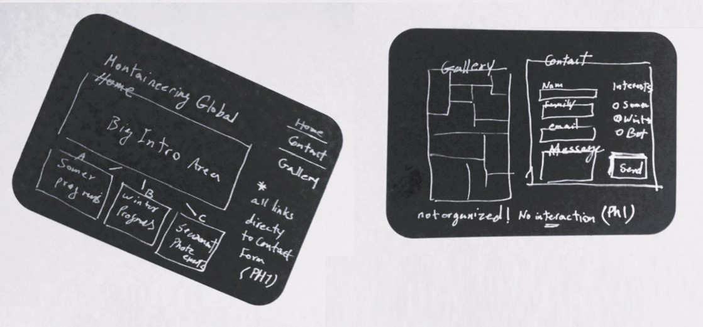
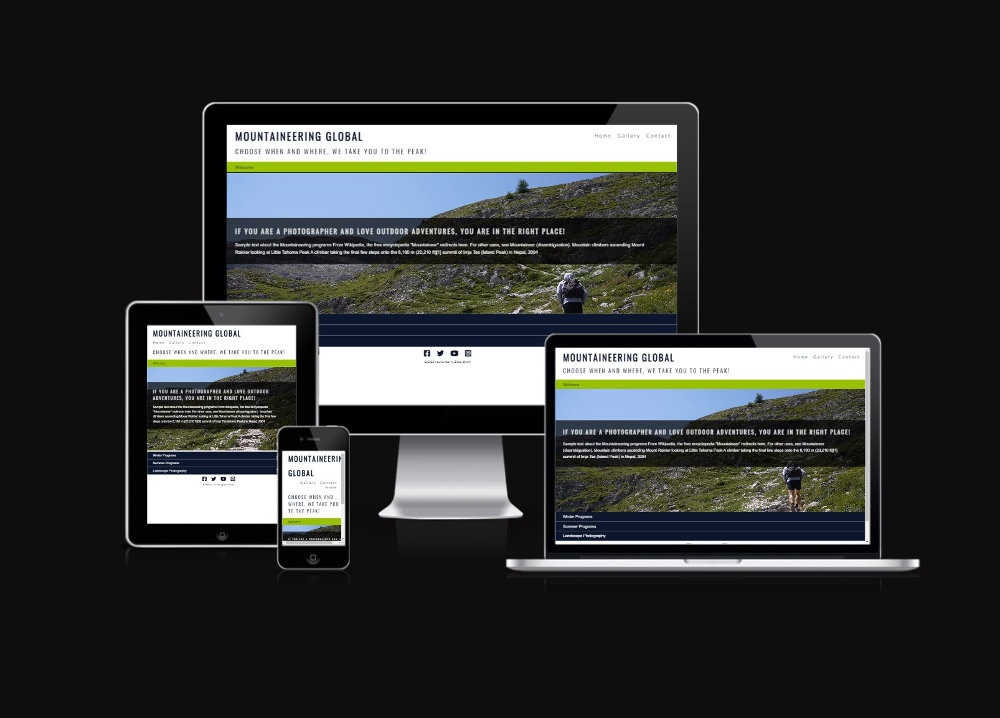
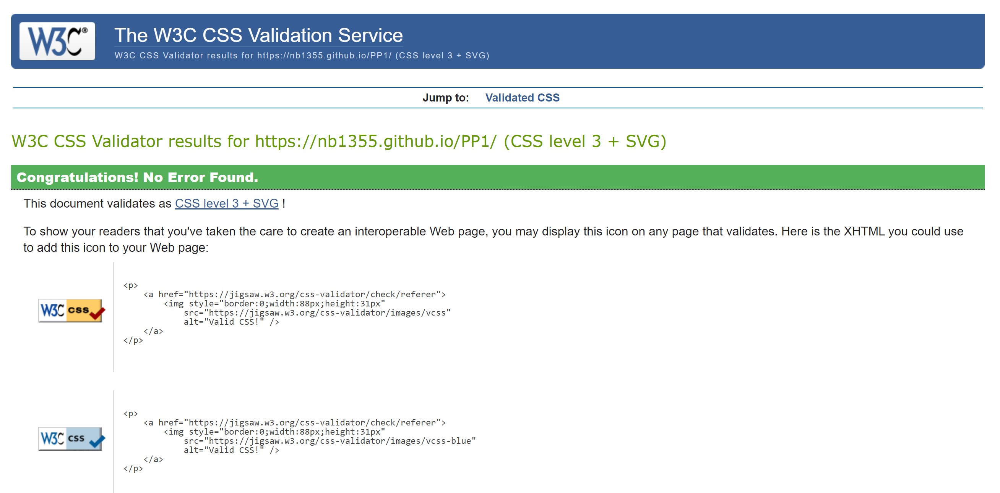
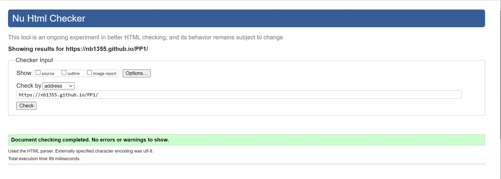

# MOUNTAINEERING GLOBAL

## Offering professional services for photography in the mountains.

This website is developing in parallel to forming a new business idea that combines mountaineering and 
professional photography services for experts interested in crossing over to the other domain. 
Using only HTML 5 and CSS 3 is the first choice to get a static responsive website running fast. 

 

## Business Requirements [Phase I]
* Creative design to represent the main branches of the business
    * Welcome and introduction to our business
    * Introduction to professional summer programs
    * Introduction to professional winter programs
    * Introduction to planned four-season photography programs
* Simple photo gallery to showcase our artistic side 
* Simple contact form supporting lengthy messages
* Access to social media directly

* Users Experience
	* 4-5 clicks away for the user to get in touch with us
	* easy navigation, proper visual experience
	* comfortable with any device size

## Delivered Product

[Visit live](https://nb1355.github.io/PP1/)

## Next Phase Potential Features
* Interactive Event Calander
* Interactive Galley
* Registration and autentication
* online shop

## Technology / Tools

* The project uses HTML 5 to create the content.
* The project uses CSS 3 to style the content and provide the layout.
* The project uses GitHub:
	* GitPod to create and edit the project files (HTML 5 and CSS 3).
	* Git to add, commit, and push the project files to GitHub.
	* GitHub Pages turns GitHub Repositories into Websites.
	* Using the GitPod Full Template from the Code Institute.
    * [W3C CSS Validator](https://jigsaw.w3.org/css-validator/)
    * [W3C Markup Validator](https://validator.w3.org/)
	* [Resopnsive Design Test](https://ui.dev/amiresponsive)

## External Resources
* [Google fonts]('https://fonts.googleapis.com/css?family=Montserrat:300') using Google fonts Ozwald and Lato in different sizes for all text 
* [Font Awesome](https://fontawesome.com/) icons for visual elements to key elements
* [kraigadams]("https://www.youtube.com/embed/WKcnvPDgifA?autoplay=1&mute=1") sample hiking video used as home 1st background
* [Thephotoargus](https://www.thephotoargus.com/most-famous-mountains-in-the-world-to-photograph/) source for the pictures 

## General Knowledge and Hours of Reading
* [W3schools](https://www.w3schools.com/)
* [Website: CSS Tricks](https://css-tricks.com/)
* [Master CSS Grids](https://mozilladevelopers.github.io/playground/css-grid/)
* [Stackoverflow](https://stackoverflow.com/)
* [codepen](https://codepen.io/mperetto/pen/QYQEGK)

# Testing
## Technical Tests

#
## Meeting BIZ Requirements [Phase I]
* Creative design to represent the main branches of the business 
* [Passd! using horizontal tabs and bring all four areas below in the Home page
    * Welcome and introduction to our business 
	* [Passe! emphasis by using a video as background]
    * Introduction to professional summer programs 
	* [Passed! background photo plus simple text cover]
    * Introduction to professional winter programs 
	* [Passed! background photo plus simple text cover]
    * Introduction to planned four-season photography programs 
	* [Passed! background photo plus four sections event tab directed to contact page.]
* Simple photo gallery to showcase our artistic side 
* [Done! improvements in the next steps]
* Simple contact form supporting lengthy messages 
* [Done! tested with CodeInstitute Script]
* Access to social media directly 
* [Done! Available in the footer of all pages]

* Users Experience
    * 4-5 clicks away for the user to get in touch with us 
	* [Passed! tested manually]
    * easy navigation, good visual experience 
	* [Passed! tested manually]
    * comfortable with any device size 
	* [Passed! Improvement possible for the contact form in tiny screens.]
## Manual User Tests

## Deployment
The project was done first in the Dev environment, tested by adding each part of the code,
after passing dev tests, deployment to the final environment is done.

The project was deployed to GitHub Pages using the following steps:

* In the GitHub repository, navigate to the Settings tab.
* From the source section drop-down menu, select the Main Branch.
* Once the main branch has been selected, the page will be automatically refreshed with a detailed ribbon display to indicate the successful deployment.
* commits show the transfer from dev and resolving minor issues at the end

#
# Credits
Special thanks to my mentor [Naoise Olof Seán Gaffney](https://github.com/NaoiseGaffney) for supporting me in designing and developing the concept.
#

####

